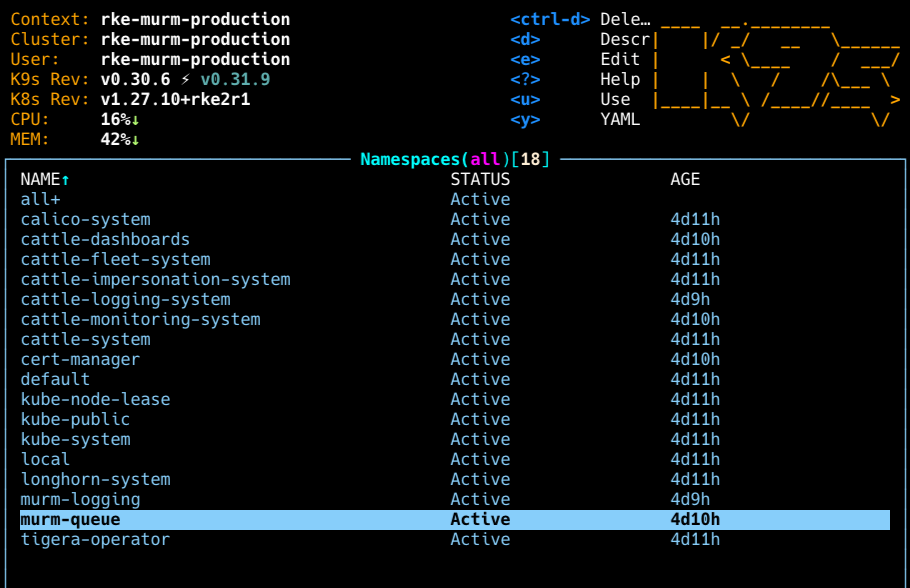

# Debugging Guide

## Table of Contents

- [Fix Failed Jobs](#fix-failed-jobs)
- [Fix Issues with Message Queues](#fix-issues-with-message-queues)

## Fix Failed Jobs

1. **Check the Namespace**: Use k9s to look at the default namespace. Look for any jobs that didn't work out.

2. **View Job Logs**: To get more info, check the logs of the job that didn't work. In k9s, press `l` to see the logs of what you've selected.

3. **See All Jobs**: In k9s, type `:jobs`. This shows all the jobs so you can see details like their status, how old they are, and more.

    

4. **Remove Old or Failed Jobs**: After finding jobs that are old or didn't succeed, you can get rid of them in k9s. Click on the job and press `command + d`. You'll be asked to confirm that you want to delete it.

    

## Fix Issues with Message Queues

Sometimes, NATS might not work right. If that happens, these steps can help reset everything by removing and letting Kubernetes (k8s) start the stateful sets again.

1. **Go to Namespace**: Use `:namespaces` in k9s to go to the namespace page.
2. **Remove the Message Queue Namespace**: Look for and select the `murm-queue` namespace.

    

3. **Delete Each Stateful Set**: Choose each NATS stateful set one by one and use `command + d` to delete them. You don't need to wait for one to restart before deleting the next.

    
