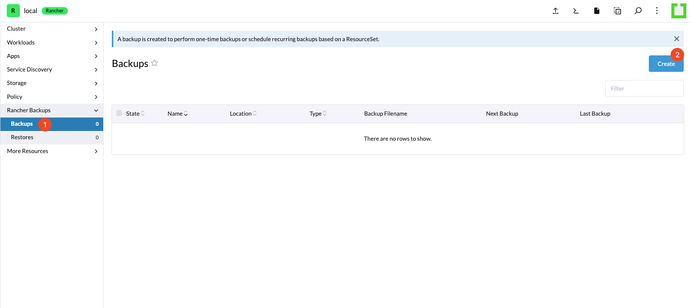
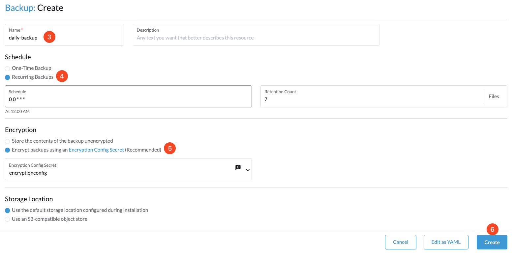

# Back Up Rancher

## Introduction

This document serves as a comprehensive guide to effectively back up your Rancher instance.

## Table of Contents

- [Introduction](#introduction)
- [Prerequisites](#prerequisites)
- [Step 1 - Switching to the K3s Cluster](#step-1---switching-to-the-k3s-cluster)
- [Step 2 - Generating a 32-Byte Encryption Key](#step-2---generating-a-32-byte-encryption-key)
- [Step 3 - Creating the Encryption Provider Configuration File](#step-3---creating-the-encryption-provider-configuration-file)
- [Step 4 - Applying the Encryption Configuration](#step-4---applying-the-encryption-configuration)
- [Step 5 - Navigating to the Rancher Backup Page](#step-5---navigating-to-the-rancher-backup-page)
- [Step 6 - Configuring and Initiating a Backup](#step-6---configuring-and-initiating-a-backup)
- [Step 7 - Verifying Backup at the Storage Location](#step-7---verifying-backup-at-the-storage-location)
- [Conclusion](#conclusion)

## Prerequisites

Before commencing the backup process, ensure you meet the following conditions:

- The Rancher Backup Tool is installed. See [Installing the Rancher Backup Tool](./install-rancher-backup-tool.md) for guidance.

## Step 1 - Switching to the K3s Cluster

Switch to the K3s cluster context where Rancher is running using the following command:

```bash
kubectl config use-context k3s-my-rancher
```

## Step 2 - Generating a 32-Byte Encryption Key

Generate a secure 32-byte encryption key with:

```bash
openssl rand -base64 32
```

Securely store this key in a safe location, such as a password manager. This will be needed if you are restoring from a new Rancher cluster.

## Step 3 - Creating the Encryption Provider Configuration File

1. Navigate to your preferred working directory.
2. Create a new file named `encryption-provider-config.yaml`.
3. Open the file in an editor and insert the following configuration, replacing `<base64-encoded-secret>` with your previously generated key:

```yaml
apiVersion: apiserver.config.k8s.io/v1
kind: EncryptionConfiguration
resources:
    - resources:
        - secrets
    providers:
        - aescbc:
            keys:
            - name: key1
                secret: <base64-encoded-secret>
        - identity: {}
```

Example commands for creating and editing the file:

```bash
cd ~/desktop
touch encryption-provider-config.yaml
vim encryption-provider-config.yaml
```

## Step 4 - Applying the Encryption Configuration

Create a Kubernetes secret in the `cattle-resources-system` namespace with your encryption configuration using:

```bash
kubectl create secret generic encryptionconfig \
  --from-file=./encryption-provider-config.yaml \
  -n cattle-resources-system
```

## Step 5 - Navigating to the Rancher Backup Page

Proceed to the Rancher dashboard and locate the Backup page within the Tools section to set up your backup.



## Step 6 - Configuring and Initiating a Backup

Set up your backup with the following settings:

- **Name:** e.g., `daily-backup`.
- **Recurring Backups:** Set a schedule, such as `0 0 * * *` for daily backups at midnight.
- **Retention Count:** Decide on the number of backups to keep, e.g., `7`.
- **Encryption:** Encrypt backups using an Encryption Config Secret.
- **Storage Location:** Use the default or specify as required.



## Step 7 - Verifying Backup at the Storage Location

After initiating the backup, ensure its successful creation and integrity at your chosen storage location.


## Conclusion

This step-by-step guide ensures that your Rancher instance is backed up securely and efficiently. Regular review and testing of your backup and restore procedures are essential for maintaining operational resilience.
