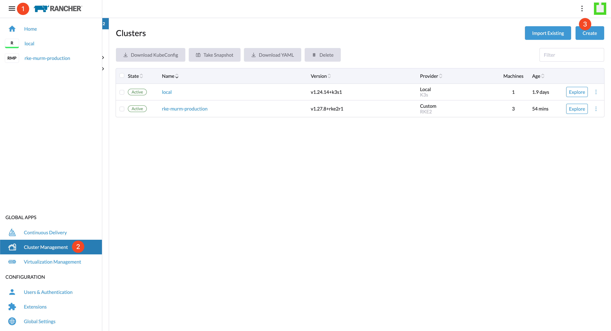
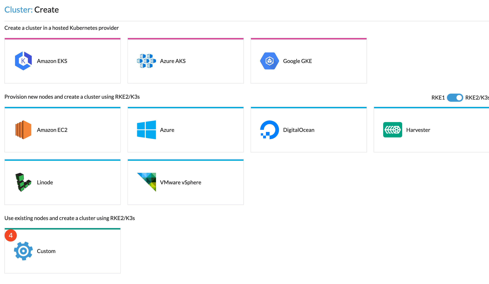
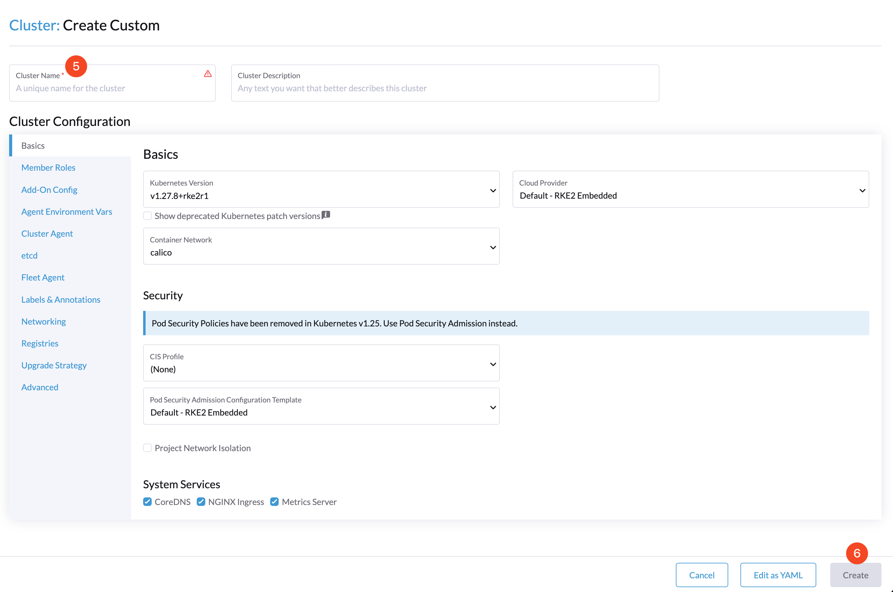
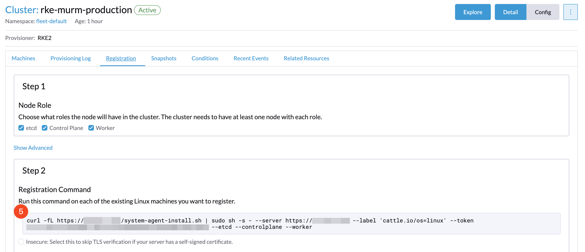
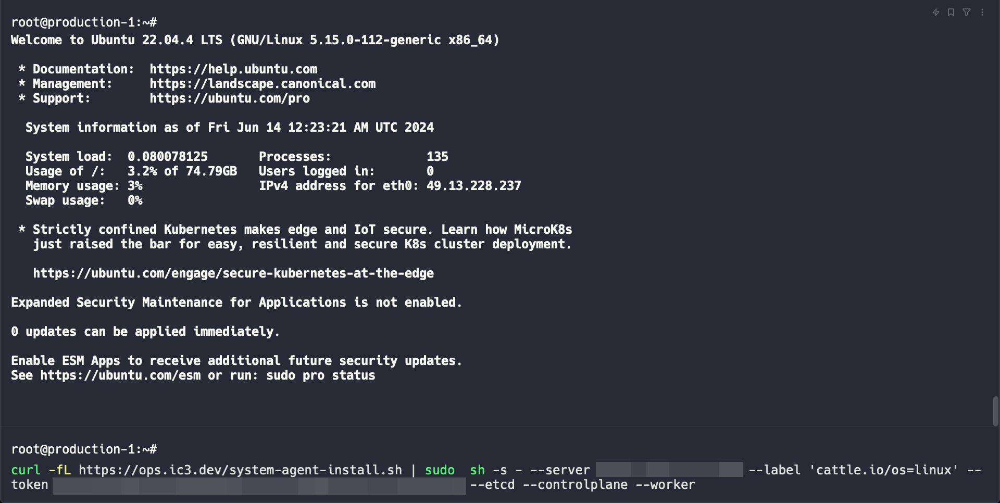
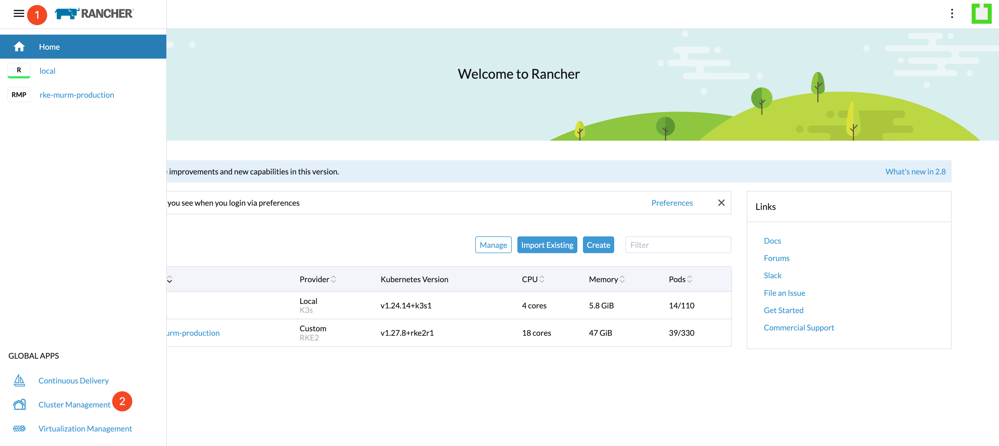

# Deploying RKE2 Using Rancher

## Introduction

This document provides a step-by-step guide for setting up an RKE2 (Rancher Kubernetes Engine 2) cluster using the Rancher dashboard. It covers the entire process from accessing the Rancher dashboard to registering nodes in your cluster.

Upon completing this guide, you will have accomplished the following:

- Accessed the Rancher dashboard.
- Initiated the creation of an RKE2 cluster.
- Registered nodes to your RKE2 cluster.

## Table of Contents

- [Introduction](#introduction)
- [Prerequisites](#prerequisites)
- [Step 1 - Accessing the Rancher Dashboard](#step-1---accessing-the-rancher-dashboard)
- [Step 2 - Initiating Cluster Creation](#step-2---initiating-cluster-creation)
- [Step 3 - Registering Nodes to the Cluster](#step-3---registering-nodes-to-the-cluster)
- [Step 4 - Retrieving the Cluster Kubeconfig](#step-4---retrieving-the-cluster-kubeconfig)
- [Conclusion](#conclusion)

## Prerequisites

Before beginning, ensure the following requirements are met:

- Confirm Rancher is installed and operational. Rancher simplifies Kubernetes cluster management.
- Prepare servers for your cluster. For guidance on server preparation, refer to the guide on setting up Ubuntu servers ([Setup Ubuntu](../01-setup-ubuntu/README.md)).

**Note**: For a HA setup, deploy an odd number of servers, at least three, for both `etcd` and `control plane` roles to ensure redundancy and avoid split-brain scenarios. This setup maintains control plane availability for managing cluster operations even if a node fails.

## Step 1 - Accessing the Rancher Dashboard

Begin by opening a web browser and navigating to `https://<rancher_url>`, substituting `<rancher_url>` with your specific Rancher URL. Log in using the credentials established during the Rancher installation.

## Step 2 - Initiating Cluster Creation

Within the Rancher dashboard, proceed to the **Cluster Management** tab and click **Create**.



Select the **Custom** option to commence the creation of a new cluster.



Input the **Cluster Name** and press **Create** to move to the subsequent step.



## Step 3 - Registering Nodes to the Cluster

Navigate to your new cluster's configuration page.


On this page, select the **Registration** tab.


This section provides the command to run on the Ubuntu servers designated for inclusion in your Kubernetes cluster.



Open a terminal, connect to your server via SSH, and execute the command provided by Rancher.



Revisit the Rancher interface and click on the **Machine** tab; your server will be listed and will require a few minutes to initialize.


## Step 4 - Retrieving the Cluster Kubeconfig

To manage your cluster with kubectl from your local environment, you need to download the kubeconfig file from Rancher.

Navigate to **Cluster Management** in Rancher.



Locate your cluster, click the `...` next to the **Explore** button, and choose **Download Kubeconfig**.


Follow the guide on [Merging Configuration Files for Cluster Management](../02-setup-k3s/README.md#step-5---merging-configuration-files-for-cluster-management) to integrate this kubeconfig with any existing configurations.

Alternatively, use the following commands to set up your kubeconfig for cluster management. Replace `<cluster_name>.yaml` with the filename of your downloaded kubeconfig:

```bash
export KUBECONFIG=~/.kube/config:~/.kube/<cluster_name>.yaml
kubectl config view --merge --flatten > ~/.kube/merged_kubeconfig
mv ~/.kube/config ~/.kube/config_backup
mv ~/.kube/merged_kubeconfig ~/.kube/config
chmod 600 ~/.kube/config
rm ~/.kube/<cluster_name>.yaml
```

This process involves merging your new kubeconfig with any existing one, backing up the original config, and then replacing it with the merged file for seamless cluster management. Remember to remove the now redundant kubeconfig file to keep your working directory clean.

## Conclusion

By following these instructions, you have successfully deployed an RKE2 cluster with Rancher. This configuration facilitates the straightforward management and scaling of your Kubernetes cluster, offering comprehensive control over your nodes and services through Rancher's robust dashboard. Your RKE2 cluster is now primed for application and service deployment.

Go to Section 5 - [Set up Load Balancer](../05-setup-lb/README.md).
