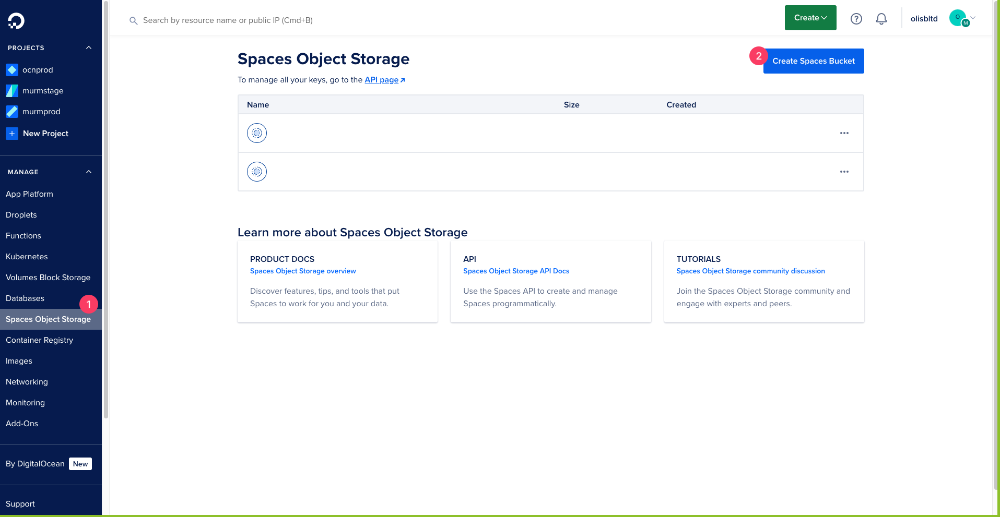
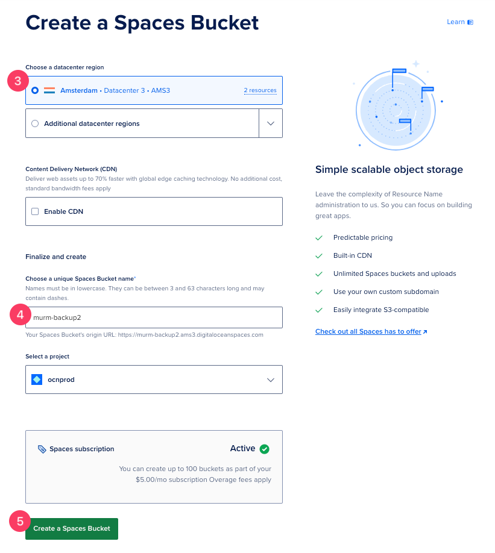
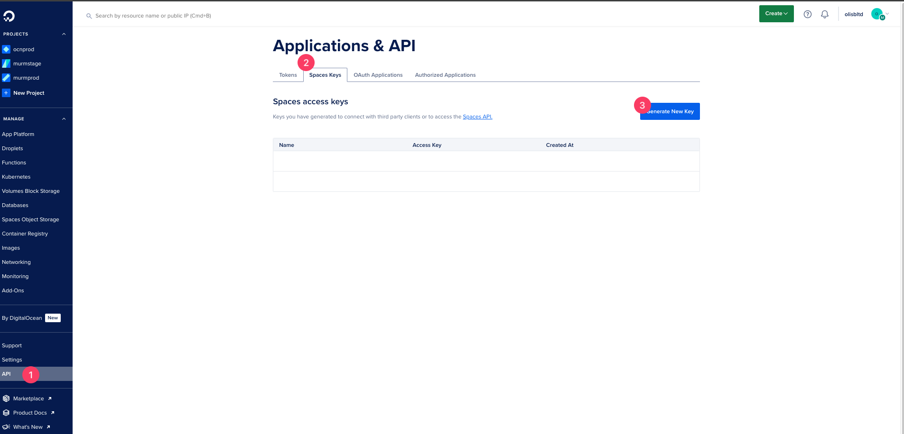
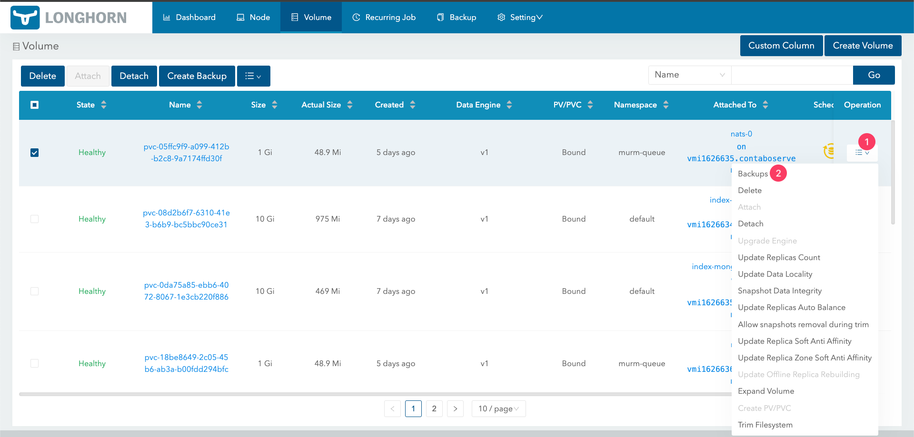
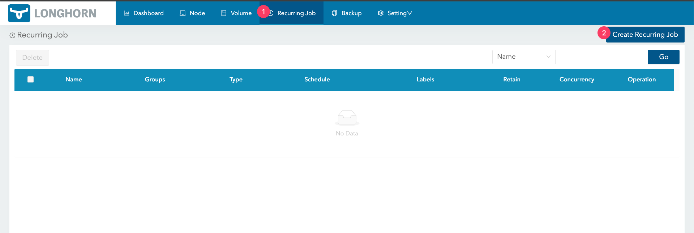
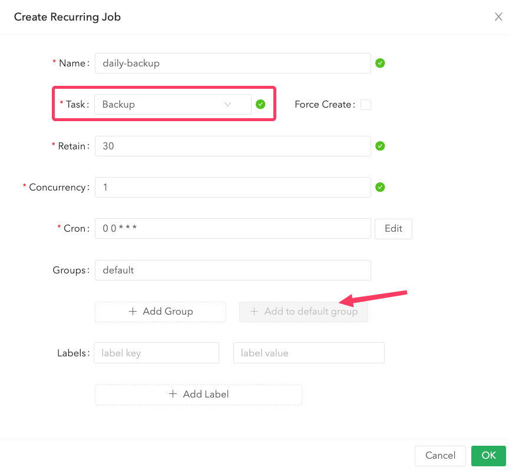

# Set Up Recurring Backup

## Introduction

This document provides a step-by-step guide on setting up recurring backups for your data using DigitalOcean object storage. By following these steps, you will create a space in DigitalOcean, generate access credentials, create a Kubernetes secret, and configure the backup settings in Longhorn.

## Table of Contents

- [Introduction](#introduction)
- [Step 1 - Creating a Space in DigitalOcean Object Storage](#step-1---creating-a-space-in-digitalocean-object-storage)
- [Step 2 - Obtaining Access Key and Secret Key](#step-2---obtaining-access-key-and-secret-key)
- [Step 3 - Creating a Kubernetes Secret](#step-3---creating-a-kubernetes-secret)
- [Step 4 - Configuring Backup Settings in Longhorn](#step-4---configuring-backup-settings-in-longhorn)
- [Step 5 - Testing the Backup](#step-5---testing-the-backup)
- [Step 6 - Verifying the Backup](#step-6---verifying-the-backup)
- [Step 7 - Creating Recurring Backups](#step-7---creating-recurring-backups)
- [Conclusion](#conclusion)

## Step 1 - Creating a Space in DigitalOcean Object Storage

Navigate to the DigitalOcean Object Storage page to create a space.



Choose "Amsterdam" for the datacenter region, provide a unique space name, and then click "Create".



## Step 2 - Obtaining Access Key and Secret Key

Navigate to the "Applications & API" section on DigitalOcean and create a Spaces access key.



## Step 3 - Creating a Kubernetes Secret

Open a terminal and switch your Kubernetes context to the desired one.

```bash
kubectl config use-context {{context}}
```

Replace `{{your_access_key}}` and `{{your_secret_key}}` with your actual credentials. Execute the following command to create the secret in the `longhorn-system` namespace:

```bash
kubectl create secret generic aws-secrets \
  --from-literal=AWS_ACCESS_KEY_ID={{your_access_key}} \
  --from-literal=AWS_SECRET_ACCESS_KEY={{your_secret_key}} \
  --from-literal=AWS_ENDPOINTS='https://ams3.digitaloceanspaces.com' \
  --from-literal=AWS_REGION=us-east-1 \
  --from-literal=VIRTUAL_HOSTED_STYLE=false \
  -n longhorn-system
```

## Step 4 - Configuring Backup Settings in Longhorn

Access the Longhorn user interface. Click on "Settings" in the top navigation bar. Within the "Backup" section, specify your Backup Target using the following format:

```bash
s3://[SPACENAME]@[REGION]/[FOLDER-NAME]
# For example: s3://mybackup@ams3/myfolder-backups
```

This configuration directs Longhorn to store backups in the specified S3-compatible storage location. Replace `[SPACENAME]` with the name of your space, `[REGION]` with the region of your storage, and `[FOLDER-NAME]` with your desired folder name for the backups.

For the Backup Target Credential Secret, use:

```bash
aws-secrets
```

Scroll down to the bottom and click on "Save".


## Step 5 - Testing the Backup

Go to the "Volume" menu, select the volume you wish to back up, click on "Create Backup," and then click "OK."


## Step 6 - Verifying the Backup

Ensure that your backup has been successfully created by navigating to the backup section and verifying the presence of your backup.




## Step 7 - Creating Recurring Backups

To set up recurring backups, go to the Recurring Job menu and click "Create Recurring Job".



Change the task to "Backup", click "Add to Default Group", and then click "OK".



## Conclusion

With the successful configuration of recurring backups using DigitalOcean object storage and Longhorn, you have now ensured the safety and availability of your data.

Go back to [Home](../README.md).
