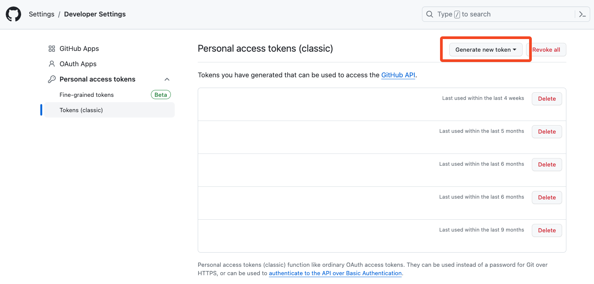

# Configuring the Murmurations Network on an RKE2 Cluster

## Introduction

This guide outlines the necessary steps to configure DNS records, install cert-manager with Helm, update ingress configurations, create required secrets, deploy Murmurations services. By following this structured approach, you ensure that your RKE2 cluster is correctly set up to host the Murmurations services.

## Table of Contents

- [Introduction](#introduction)
- [Prerequisites](#prerequisites)
- [Step 1 - Configuring DNS Records](#step-1---configuring-dns-records)
- [Step 2 - Switching Kubernetes Context](#step-2---switching-kubernetes-context)
- [Step 3 - Installing Cert-Manager with Helm](#step-3---installing-cert-manager-with-helm)
- [Step 4 - Updating Ingress Configuration](#step-4---updating-ingress-configuration)
- [Step 5 - Creating Required Secrets](#step-5---creating-required-secrets)
- [Step 6 - Deploying the Services](#step-6---deploying-the-services)
- [Step 7 - Checking the Deployment](#step-7---checking-the-deployment)
- [Conclusion](#conclusion)

## Prerequisites

Before you start, ensure you have:

- Administrative access to your RKE2 cluster.
- `kubectl` and `helm` tools installed and configured on your local computer.
- A GitHub account for creating personal access tokens.

## Step 1 - Configuring DNS Records

Configure DNS A records for your services by pointing them to your load balancer URL created in the [Setup Load Balancer Tutorial](../05-setup-lb/README.md). Example DNS configurations:

```bash
index.your.site C <load_balancer_url>
library.your.site C <load_balancer_url>
data-proxy.your.site C <load_balancer_url>
```

## Step 2 - Switching Kubernetes Context

Switch to the Kubernetes context for your cluster where the Murmurations services will be deployed:

```bash
kubectl config use-context <context_name>
```

Replace `<context_name>` with your cluster's context name.

## Step 3 - Installing Cert-Manager with Helm

Install `cert-manager` in your cluster to manage certificates automatically:

```bash
helm install cert-manager jetstack/cert-manager \
  --namespace cert-manager \
  --create-namespace \
  --set installCRDs=true
```

## Step 4 - Updating Ingress Configuration

In this step, you will update both the [ingress.yaml](../../../charts/murmurations/charts/ingress/templates/ingress/ingress.yaml) and [issuer.yaml](../../../charts/murmurations/charts/ingress/templates/cert/issuer.yaml) configurations to ensure correct traffic routing to your deployed services. Specifically, you will modify the [ingress.yaml](../../../charts/murmurations/charts/ingress/templates/ingress/ingress.yaml) file to replace the default URLs with the custom URLs you established for your Murmurations services in Step 1. Additionally, update the [issuer.yaml](../../../charts/murmurations/charts/ingress/templates/cert/issuer.yaml) file by replacing the existing email with your own email address.

Please be aware that we currently support 4 environments: `production`, `staging`, `pretest`, and `development`. The staging environment mirrors production to provide a testing ground for users, while pretest is dedicated to CI/CD processes only.

This table demonstrates how to update the production URLs in the `ingress.yaml` file:

|           Ingress.yaml             |        Updated Ingress.yaml   |
|------------------------------------|-------------------------------|
| index.murmurations.network         |     index.your.website        |
| library.murmurations.network       |     library.your.website      |
| data-proxy.murmurations.network    |     data-proxy.your.website   |

## Step 5 - Creating Required Secrets

Create Kubernetes secrets for MongoDB credentials and any other necessary secrets for the operation of Murmurations services.

Remember to replace those `<*-password>` placeholders below with strong passwords. Also make sure you use the same strong password for usernames that are the same (e.g., all instances of `index-admin-password` below should be using the same strong password).

```bash
kubectl \
  create secret generic index-mongo-secret \
  --from-literal="MONGO_INITDB_ROOT_USERNAME=index-admin" \
  --from-literal="MONGO_INITDB_ROOT_PASSWORD=<index-admin-password>"

kubectl \
  create secret generic library-mongo-secret \
  --from-literal="MONGO_INITDB_ROOT_USERNAME=library-admin" \
  --from-literal="MONGO_INITDB_ROOT_PASSWORD=<library-admin-password>"

kubectl \
  create secret generic data-proxy-mongo-secret \
  --from-literal="MONGO_INITDB_ROOT_USERNAME=data-proxy-admin" \
  --from-literal="MONGO_INITDB_ROOT_PASSWORD=<data-proxy-password>"

kubectl \
  create secret generic index-secret \
  --from-literal="MONGO_USERNAME=index-admin" \
  --from-literal="MONGO_PASSWORD=<index-admin-password>"

kubectl \
  create secret generic library-secret \
  --from-literal="MONGO_USERNAME=library-admin" \
  --from-literal="MONGO_PASSWORD=<library-admin-password>"

kubectl \
  create secret generic data-proxy-secret \
  --from-literal="MONGO_USERNAME=data-proxy-admin" \
  --from-literal="MONGO_PASSWORD=<data-proxy-password>"

kubectl \
  create secret generic nodecleaner-secret \
  --from-literal="MONGO_USERNAME=index-admin" \
  --from-literal="MONGO_PASSWORD=<index-admin-password>"

kubectl \
  create secret generic revalidatenode-secret \
  --from-literal="MONGO_USERNAME=index-admin" \
  --from-literal="MONGO_PASSWORD=<index-admin-password>"

kubectl \
  create secret generic dataproxyupdater-secret \
  --from-literal="MONGO_USERNAME=data-proxy-admin" \
  --from-literal="MONGO_PASSWORD=<data-proxy-password>"

kubectl \
  create secret generic dataproxyrefresher-secret \
  --from-literal="MONGO_USERNAME=data-proxy-admin" \
  --from-literal="MONGO_PASSWORD=<data-proxy-password>"

kubectl \
  create secret generic schemaparser-secret \
  --from-literal="MONGO_USERNAME=library-admin" \
  --from-literal="MONGO_PASSWORD=<library-admin-password>" \
  --from-literal="GITHUB_TOKEN=<GITHUB_TOKEN>"
```

For how to obtain the `GITHUB_TOKEN`, please refer to [GitHub's documentation](https://docs.github.com/en/authentication/keeping-your-account-and-data-secure/creating-a-personal-access-token) for creating a personal access token. No additional scopes are needed.



## Step 6 - Deploying the Services

Deploy the Murmurations services to your Kubernetes cluster:

```bash
make deploy-all-services DEPLOY_ENV=<environment>
```

## Step 7 - Checking the Deployment

During the deployment, open another tab from the terminal and run the following command to check the status of the deployment:

```bash
kubectl get pods --watch
```

## Conclusion

By completing the steps in this guide, you have successfully configured your Kubernetes cluster to host Murmurations Network services.

Go to Section 8 - [Set Up Monitoring](../08-setup-monitoring/README.md).
