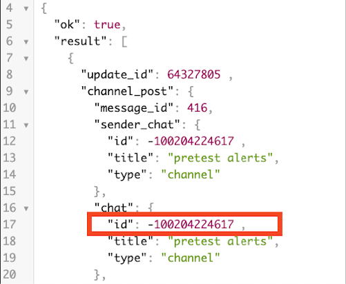

# How to Create and Configure a Telegram Bot for Alerts

## Introduction

This guide outlines the steps to create a Telegram bot and set up a dedicated group for alerts. Completing this tutorial will enable you to obtain a `botToken` and a `chat_id`, which are essential for receiving alerts from RKE2 cluster.

## Table of Contents

- [Introduction](#introduction)
- [Prerequisites](#prerequisites)
- [Step 1 - Creating a Telegram Bot](#step-1---creating-a-telegram-bot)
- [Step 2 - Setting Up a Group for Alerts](#step-2---setting-up-a-group-for-alerts)
- [Conclusion](#conclusion)

## Prerequisites

Before you begin, ensure you have:

- A Telegram account.
- The Telegram application installed on your mobile device or desktop.
- A basic familiarity with Telegram's functionality.

## Step 1 - Creating a Telegram Bot

1. Open the Telegram application and search for `@BotFather`.
2. Start a conversation with `@BotFather` by clicking "Start".
3. Send `/newbot` to `@BotFather` to initiate the bot creation process.
4. Follow the instructions to give your bot a name and a unique username.
5. After creation, `@BotFather` will provide a `botToken`. Securely store this token, as it is crucial for your bot's operations.

## Step 2 - Setting Up a Group for Alerts

1. In Telegram, create a new group that will serve as the destination for your alerts.
2. After the group is created, navigate to the group and click "Add." Then, search for @your_bot_username, click on the bot, and select "Add."
3. To activate your bot within the group, send a command like `/hello @your_bot_username`.
4. Visit `https://api.telegram.org/bot{{your-bot-token}}/getUpdates` in your browser, replacing `{{your-bot-token}}` with your bot's token.
5. Send a message to the group and refresh the browser page to view the updates. Look for the chat JSON object in the response to locate your group's `chat_id`. This ID, typically a negative number, is required for integrating your bot with alert systems.

## Conclusion

By following the steps in this guide, you have successfully created a Telegram bot and configured a group for receiving alerts, obtaining both the `botToken` and `chat_id`. Now you can configure your server to RKE2 cluster to receive the alerts.

Go back to [Home](../README.md).
