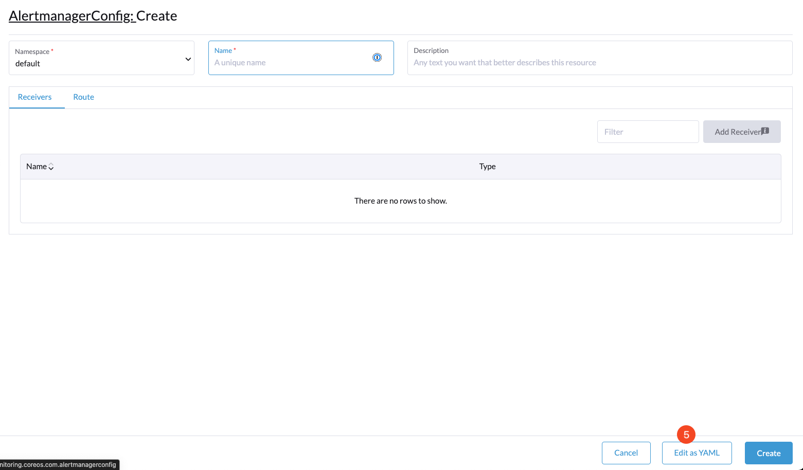
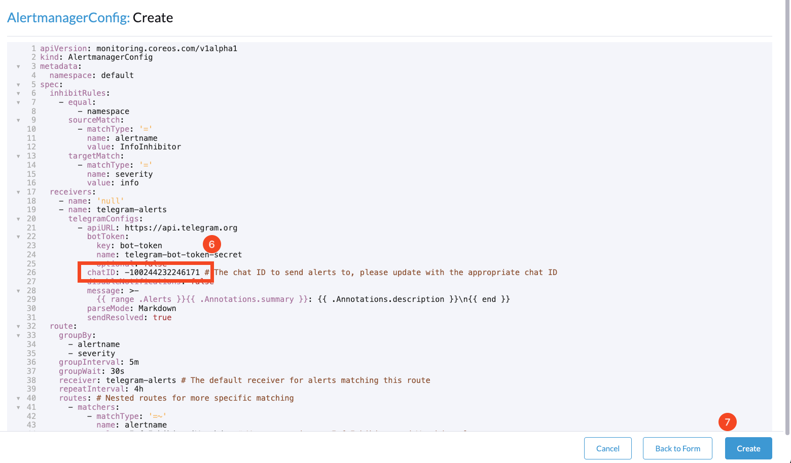

# How to Receive Alerts

## Introduction

This guide outlines the process of configuring your Kubernetes cluster to send alerts to a Telegram group.

## Table of Contents

- [Introduction](#introduction)
- [Prerequisites](#prerequisites)
- [Step 1 - Creating a Secret for the Telegram Bot Token](#step-1---creating-a-secret-for-the-telegram-bot-token)
- [Step 2 - Accessing Your Kubernetes Cluster Dashboard](#step-2---accessing-your-kubernetes-cluster-dashboard)
- [Step 3 - Navigating to Monitoring](#step-3---navigating-to-monitoring)
- [Step 4 - Configuring Alertmanager](#step-4---configuring-alertmanager)
- [Step 5 - Editing Configuration](#step-5---editing-configuration)
- [Step 6 - Applying Your Configuration](#step-6---applying-your-configuration)
- [Conclusion](#conclusion)

## Prerequisites

Before you begin, ensure you have:

1. A Telegram `bot token` and `chat id`. If you haven't created a Telegram bot yet, follow the instructions [here](./create-a-telegram-bot.md).

## Step 1 - Creating a Secret for the Telegram Bot Token

Securely store your Telegram bot token as a Kubernetes secret:

```bash
kubectl create secret generic telegram-bot-token-secret --from-literal=bot-token=<bot-token> --namespace=default
```

Ensure to replace `<bot-token>` with your actual Telegram bot token.

## Step 2 - Accessing Your Kubernetes Cluster Dashboard

Access your cluster dashboard to manage and monitor resources:


## Step 3 - Navigating to Monitoring

Within the dashboard, select "Monitoring" to access the alerting tools:


## Step 4 - Configuring Alertmanager

Find "Alertmanager Config" under the "Alert" section to start configuring alerts:


## Step 5 - Editing Configuration

Choose "Edit as YAML" to directly modify the Alertmanager configuration:



## Step 6 - Applying Your Configuration

Insert the Alertmanager configuration into the YAML editor and save. Remember to replace `telegram-chat-id` with your Telegram group's chat id.

Here is a sample YAML configuration for Alertmanager to send alerts to Telegram:

```yaml
apiVersion: monitoring.coreos.com/v1alpha1
kind: AlertmanagerConfig
metadata:
  namespace: default
spec:
  inhibitRules:
    - equal:
        - namespace
      sourceMatch:
        - matchType: '='
          name: alertname
          value: InfoInhibitor
      targetMatch:
        - matchType: '='
          name: severity
          value: info
  receivers:
    - name: 'null'
    - name: telegram-alerts
      telegramConfigs:
        - apiURL: https://api.telegram.org
          botToken:
            key: bot-token
            name: telegram-bot-token-secret
            optional: false
          chatID: "telegram-chat-id" # The chat ID to send alerts to, please update with the appropriate chat ID
          disableNotifications: false
          message: >-
            {{ range .Alerts }}{{ .Annotations.summary }}: {{ .Annotations.description }}\n{{ end }}
          parseMode: Markdown
          sendResolved: true
  route:
    groupBy:
      - alertname
      - severity
    groupInterval: 5m
    groupWait: 30s
    receiver: telegram-alerts # The default receiver for alerts matching this route
    repeatInterval: 4h
    routes: # Nested routes for more specific matching
      - matchers:
          - matchType: '=~'
            name: alertname
            value: InfoInhibitor|Watchdog # We want to ignore InfoInhibitor and Watchdog alerts.
        receiver: 'null' # Alerts matching this route are ignored
```

Ensure to replace `telegram-chat-id` with your Telegram group's chat_id.

For detailed Alertmanager configuration instructions, refer to [AlertmanagerConfig Documentation](https://docs.openshift.com/container-platform/4.11/rest_api/monitoring_apis/alertmanagerconfig-monitoring-coreos-com-v1beta1.html).



## Conclusion

By following these steps, your Kubernetes cluster is now configured to send alerts to a Telegram group. This integration with Alertmanager ensures you are promptly notified of any significant events, allowing for quick responses to incidents.
